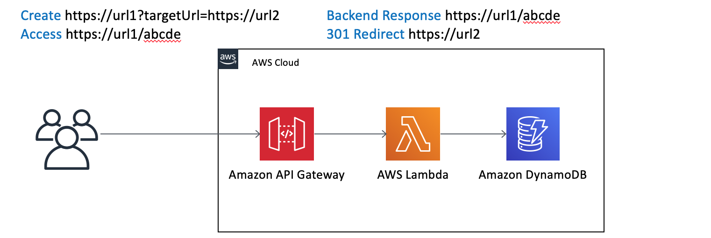
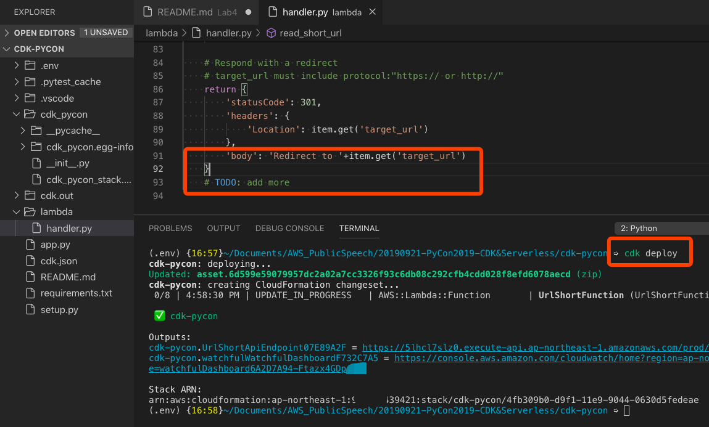
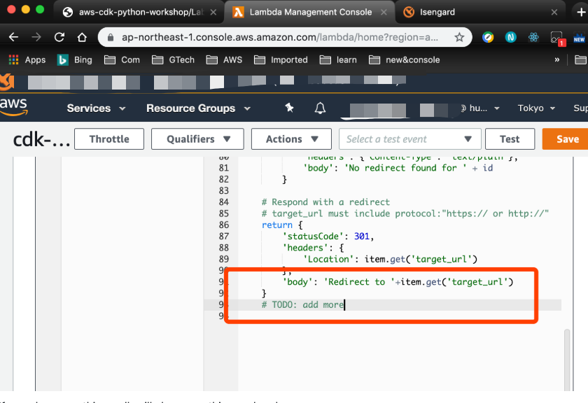
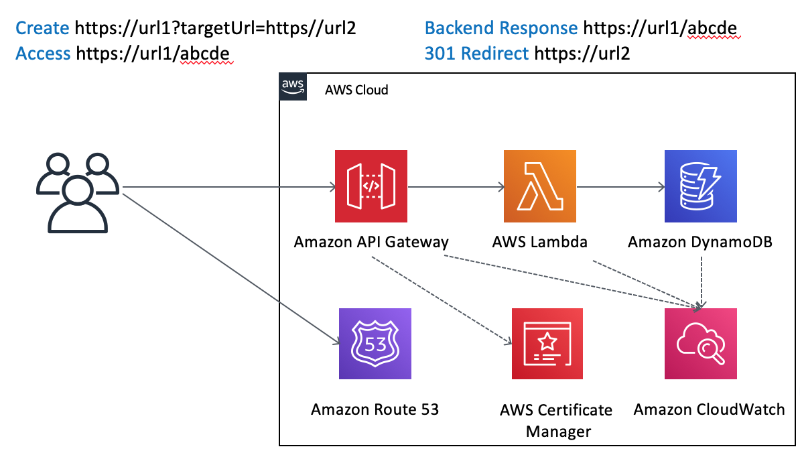

# Lab 4 - 使用 AWS CDK 创建无服务器短URL应用(Python)  

## 架构
本实验中，我们会创建一个无服务器的应用，该应用将长 URL 转换成短 URL，如以下架构图。  
AWS CDK (Cloud Development Toolkit) 是一个基于 AWS CloudFormation 之上的 Infrastructure as Code 基础设施即代码的工具，而比 CloudFormation 更容易编写和 Debug ，而且速度更快，支持 TypeScript, Python, Java 和 .NET 。具体参考 [AWS CDK 文档](https://aws.amazon.com/cdk/)


## 准备  
* 安装 Node.js (>= 8.11.x)   
https://nodejs.org/en/download/  
or 
http://nodejs.cn/download/  
备注:  
AWS CDK 是基于 TypeScript 开发，并转换为 JavaScript。我们使用 Python 来编写 CDK 时实际上是利用 AWS CDK 基于 Node.js 的引擎。
* 安装 Python >= 3.6  
  
* 安装 AWS CDK
```
npm install -g aws-cdk
cdk --version
```
安装 Python 相应的依赖
```
pip install --upgrade aws-cdk.core
```
更多关于 AWS CDK 的安装说明，参考 https://docs.aws.amazon.com/cdk/latest/guide/getting_started.html
* 安装 AWS CLI 命令行工具
```
pip install awscli
aws --version
```
更多关于 AWS CLI 的说明参考 https://aws.amazon.com/cli/
* 配置密钥和默认 AWS Region
为本实验配置 IAM User credential 密钥和默认 region 。我可以使用中国宁夏 region，该 region 名称代码为 cn-northwest-1
```
$ aws configure
AWS Access Key ID [****************Y7HQ]:
AWS Secret Access Key [****************rkr0]:
Default region name [cn-northwest-1]:
Default output format [text]:
```
更多关于 aws configure 的配置，请参考文档 https://docs.aws.amazon.com/cli/latest/userguide/cli-chap-configure.html
## Init 初始化项目
* 在本地创建新目录，并初始化项目
```
mkdir cdk-pycon
cd cdk-pycon
cdk init app --language=python
```
* 打开你熟悉的 IDE  
```
code .
或
pycharm .
```
* 初始化项目完成，你可以检查项目目录结构，并在 IDE 中编辑 ./setup.py，增加需要的依赖   


* 替换 setup 文件中的 install_requires 为以下内容
```python
    install_requires=[
        "aws-cdk.core",
        "aws-cdk.aws-dynamodb",
        "aws-cdk.aws-events",
        "aws-cdk.aws-events-targets",
        "aws-cdk.aws-lambda",
        "aws-cdk.aws-s3",
        "aws-cdk.aws-ec2",
        "aws-cdk.aws-ecs-patterns",
        "aws-cdk.aws-certificatemanager",
        "aws-cdk.aws-apigateway",
        "aws-cdk.aws-cloudwatch",
        "cdk-watchful",
        "boto3"
    ],
```
* 然后在 IDE 中打开一个 Terminal 终端，并创建环境和安装依赖  
```
python3 -m venv .env
source .env/bin/activate
pip install -r requirements.txt
```
* 你需要选择 IDE 中的 interpreter 解析器环境


现在可以开始编辑基础设施了   
## Coding 代码编写  
* 打开 ./cdk_pycon/cdk_pycon_stack.py 其内容应该类似如下:  
```python
from aws_cdk import core


class CdkPyconStack(core.Stack):

    def __init__(self, scope: core.Construct, id: str, **kwargs) -> None:
        super().__init__(scope, id, **kwargs)

        # The code that defines your stack goes here
```
* 增加一个 DynamoDB 表到代码  
导入 aws_dynamodb 模块并增加 Table 代码就变成如下，可以自行修改 Table 名字或表结构：  
```python
from aws_cdk import core, aws_dynamodb


class CdkPyconStack(core.Stack):

    def __init__(self, scope: core.Construct, id: str, **kwargs) -> None:
        super().__init__(scope, id, **kwargs)

        # The code that defines your stack goes here
        table = aws_dynamodb.Table(self, "Table",
                        partition_key=aws_dynamodb.Attribute(
                            name="id",
                            type=aws_dynamodb.AttributeType.STRING))
```
如需修改参数，可以参考 [AWS CDK 文档](https://docs.aws.amazon.com/cdk/api/latest/python/index.html)  
或者在 VSCode 中查看在线帮助 ALT + Mouse Over :


或者在 PyCharm 中启用 Quick Documentation  :


## Deploy 部署
* 在 Terminal 终端中部署:
```
cdk bootstrap
cdk deploy
```
bootstrap 只需在首次使用 CDK 时执行一次，其会创一个 S3 Bucket 作为 Stage 文件存放的地方。  
执行 deploy 时的对话中选择 "y" 确认执行    
你也可以打开 AWS 控制台中的 CloudFormation 来观察执行过程。  
一分钟后， DynamoDB table 建好了。


## Update  更新
* 增加 AWS Lambda function 代码  
项目目录下创建一个子目录，拷贝本 github 的 lambda function 代码到 ./lambda/handler.py 如下例：   


* 在 stack 文件中增加 Lambda 和 API Gateway 基础设施  
打开 cdk_pycon_stack.py 文件，Import aws_lambda 和 aws_apigateway 模块。并增加对应代码，之前的代码文件就变成如下： 
```python
from aws_cdk import core, aws_dynamodb, aws_lambda, aws_apigateway


class CdkPyconStack(core.Stack):

    def __init__(self, scope: core.Construct, id: str, **kwargs) -> None:
        super().__init__(scope, id, **kwargs)

        # define the table that maps short codes to URLs.
        table = aws_dynamodb.Table(self, "Table",
                        partition_key=aws_dynamodb.Attribute(
                            name="id",
                            type=aws_dynamodb.AttributeType.STRING))

        # define the API gateway request handler. all API requests will go to the same function.
        handler = aws_lambda.Function(self, "UrlShortFunction",
                                      code=aws_lambda.Code.asset("./lambda"),
                                      handler="handler.main",
                                      runtime=aws_lambda.Runtime.PYTHON_3_7)

        # pass the table name to the handler through an environment variable and grant
        # the handler read/write permissions on the table.
        handler.add_environment('TABLE_NAME', table.table_name)
        table.grant_read_write_data(handler)

        # define the API endpoint and associate the handler
        api = aws_apigateway.LambdaRestApi(self, "UrlShortApi",
                                           handler=handler,
                                           endpoint_types=[aws_apigateway.EndpointType.REGIONAL])
```
* 在 Terminal 终端中执行部署更新:
```
cdk deploy
```

部署时间大约3分钟  
* 从 cdk deploy output 可以看到 url ，拷贝这个 Api Gateway 入口地址 https://xxxxxx.execute-api.cn-westnorth-1.amazonaws.com/prod/  
## 使用浏览器进行测试该应用的 URL 转换功能  
1. 访问 API，获取提示  
服务后端返回使用查询参数的提示  


2. 在 API URL 后面增加查询参数和要转译的原始 URL https://your_target_url   
服务后端返回创建的短 URL 编码


可以打开控制台，观察 DynamoDB 表中增加的记录。 AWS Console -> DynamoDB -> Table 

3. 使用前面步骤返回的 URL 来访问  


后台返回跳转，浏览器会打开跳转后的页面  


## Monitor 监控
* 在 ./cdk_pycon/cdk_pycon_stack.py 代码中增加 Import Watchful 模块   
```
from cdk_watchful import Watchful
```
* 增加以下代码  
以下时自动创建一个 CloudWatch Dashboard 监控所有你刚才创建的资源，并建一个 SNS 告警发送到你的邮件地址，只需两行代码：   
```python
    wf = Watchful(self, 'watchful', alarm_email='your@email.com')
    wf.watch_scope(self)
```
最终完整的 stack 代码：[cdk_pycon_stack.py](./cdk_pycon/cdk_pycon_stack.py)
* 在 Terminal 终端中部署更新
```
cdk deploy
```
* 从 deploy output 看到监控的链接，点击即可打开 CloudWatch Dashboard


可以看到创建的监控指标和报警包括  DynamoDB, Lambda 和 API Gateway  


## 如果只更新 Lambda 代码呢？  
* 只需修改 Lambda 代码并执行 cdk deploy  
AWS CDK 会自动创建 changeset 并更新云上的代码。以下尝试在原 Lambda 代码中进行修改并部署。  



打开 AWS 控制台 -> Lambda，看到 Lambda 代码已经被更新  



* 如果不改变任何东西，直接部署， cdk 会什么都不改变 


## Custom Domain 自定义域名 (optional)
你已经完成了这个项目的后台创建，但你可能还希望使用自己的域名来做 API，而不是 amazonaws 域名（确实也太长了）。参考以下步骤，来配置自定义域名，并且无需再带上 stage path /prod/ 例如 go.xyz.com
1. 在 Amazon Certificate Manager 服务中创建 SSL certificate （注：中国区没ACM服务，则直接在  APIGateway 中导入 SSL certificate  
2. 在 Amazon API Gateway 服务中创建 Custom Domain Name   
   并绑定 SSL certificate 与 api/stage  
3. 在 DNS 服务，例如 Amazon Rout53 创建 CNAME 记录。转发 go.xyz.com 到你创建的 API  

参考更多的代码示例： https://github.com/aws-samples/aws-cdk-examples/tree/master/python/url-shortener  
Youtube https://youtu.be/ZWCvNFUN-sU?t=336  

最终架构  

## Clean 清理
一个命令即可删除全部资源
```
cdk destroy
```
你可以在控制台中观察 CloudFormation 的清理情况。如果不在 CloudFormation 方式中修改的，则不会被删除，需要手工删除，例如 DynamoDB 中增加的记录。