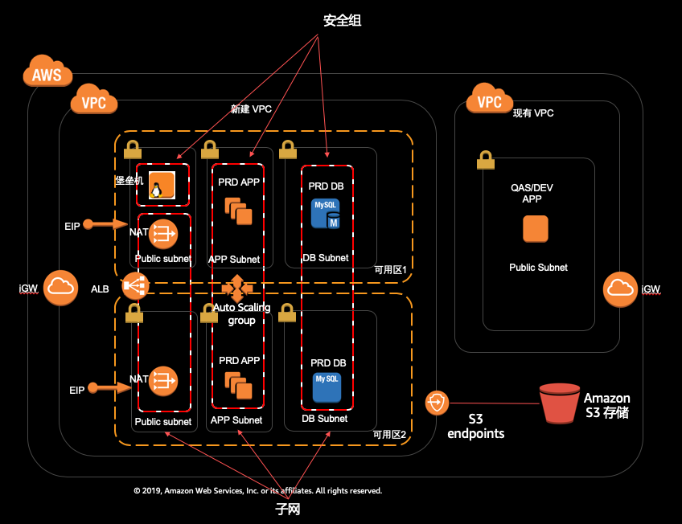

# AWS CDK Example (Python)

* Lab 1 ExistVpc + New1EC2 + 2EBS + UserData  
在现有 VPC 上新建1个 EC2 ，自定制2个 EBS ，配置 EC2 UserData，安全组  
* Lab 2 NewVpc + ALB + ASG2EC2 + EBS + UserData  
新建一个有6个子网的 VPC，新建 ALB 并指向 Autoscaling Group，EC2 采用自动查找最新的 Amazon Linux AMI，自定义 EBS 大小和类型，配置 UserData  
* Lab 3 S3 + Lambda + Layer
新建S3桶，上传图片自动触发 Lambda 转换图片格式和大小  
* Lab 4 APIGateway + Lambda + DDB
创建无服务器短URL应用  

## 准备  
* 安装 Node.js (>= 8.11.x)   
https://nodejs.org/en/download/  或  http://nodejs.cn/download/  
备注: AWS CDK 是基于 TypeScript ，并转换为我们使用的 Python ，实际上是利用 AWS CDK 基于 Node.js 的引擎。所以用 Python 编写仍然要安装 Node.JS  
* 安装 Python >= 3.6  
  
* 安装 AWS CDK
```bash
npm install -g aws-cdk
cdk --version
```
安装 Python 相应的依赖
```bash
pip install --upgrade aws-cdk.core
```
更多关于 AWS CDK 的安装说明，参考 https://docs.aws.amazon.com/cdk/latest/guide/getting_started.html
* 安装 AWS CLI 命令行工具
```bash
pip install awscli
aws --version
```
更多关于 AWS CLI 的说明参考 https://aws.amazon.com/cli/
* 配置密钥和默认 AWS Region
为本实验配置 IAM User credential 密钥和默认 region 。我可以使用中国宁夏 region，该 region 名称代码为 cn-northwest-1
```bash
$ aws configure
AWS Access Key ID [****************Y7HQ]:
AWS Secret Access Key [****************rkr0]:
Default region name [cn-northwest-1]:
Default output format [text]:
```
更多关于 aws configure 的配置，请参考文档 https://docs.aws.amazon.com/cli/latest/userguide/cli-chap-configure.html  
## Init 初始化项目
* 在本地创建新目录，并初始化项目
```bash
mkdir cdk-vpc-ec2
cd cdk-vpc-ec2
cdk init app --language=python
```
* 初始化项目完成，你可以检查项目目录结构，并编辑 ./setup.py，增加需要的依赖   
替换 setup 文件中的 install_requires 为以下内容，可根据需要删减  
```python
    install_requires=[
        "aws-cdk.core",
        "aws-cdk.aws-dynamodb",
        "aws-cdk.aws-events",
        "aws-cdk.aws-events-targets",
        "aws-cdk.aws-lambda",
        "aws-cdk.aws-s3",
        "aws-cdk.aws-ec2",
        "aws-cdk.aws-elasticloadbalancingv2",
        "aws-cdk.aws-autoscaling"
        "aws-cdk.aws-certificatemanager",
        "aws-cdk.aws-apigateway",
        "aws-cdk.aws-cloudwatch",
        "cdk-watchful",
        "boto3"
    ],
```
* 打开一个 Terminal 终端，并创建环境和安装依赖  
```bash
python3 -m venv .env
source .env/bin/activate
pip install -r requirements.txt
```
现在可以开始编辑基础设施了   
## Lab 1 &2 的架构图

## Lab 1 ExistVpc+New1EC2+2EBS+UserData  
在现有 VPC 上新建1个 EC2 ，自定制2个 EBS ，配置 EC2 UserData，安全组  
* 打开 app.py 替换代码并修改以下 Account ID 为你的AWS Account ID, 要部署的 Region。这里因为是在现有 VPC 中部署，需要读取 VPC 信息，还需要读取 Region 信息，所以需要手工设置 Account 和 Region。  
```
env_cn = core.Environment(account="11111111", region="cn-northwest-1")
```
* 打开 ./cdk_vpc_ec2/cdk_vpc_ec2_stack.py 替换代码并修改以下变量：  
```
vpc_id = "vpc-111111111"
ec2_type = "m5.xlarge"
key_name = "id_rsa"
linux_ami = ec2.GenericLinuxImage({
    "cn-northwest-1": "ami-0f62e91915e16cfc2",
    "eu-west-1": "ami-12345678"
})
```
定义要部署的现有VPC ID，EC2 类型，登录EC2 Key的名称，还有使用Region的 EC2 AMI ID。这里用了指定 AMI ID 的方式。如果只想使用最新的 Amazon Linux AMI，则可以参考 Lab2 的方法使用ec2.AmazonLinuxImage方法。  
如需修改参数，可以参考 [AWS CDK 文档](https://docs.aws.amazon.com/cdk/api/latest/python/index.html)  
或者在 VSCode 中查看在线帮助: ALT + Mouse Over  
或者在 PyCharm 中启用 Quick Documentation: CTL + J  
* 打开 ./user_data/user_data.sh 根据需要修改 UserData
* 在 Terminal 终端中部署:
```bash
cdk bootstrap
cdk deploy
```
bootstrap 只需在首次使用 CDK 时执行一次，其会创一个 S3 Bucket 作为 Stage 文件存放的地方。  执行 deploy 时的对话中选择 "y" 确认执行。  你也可以打开 AWS 控制台中的 CloudFormation 来观察执行过程。  
* 部署完成后，会输出 EC2 的公网地址

## Lab 2 NewVpc+ALB+ASG2EC2+EBS+UserData  
新建一个有6个子网的 VPC，新建 ALB 并指向 Autoscaling Group，EC2 采用自动查找最新的 Amazon Linux AMI，自定义 EBS 大小和类型，配置 UserData  
请重新初始化一个新的项目，在新的目录下进行以下的Lab。  
* 打开 app.py ，修改代码。
在这个Lab中我们把 VPC 和 EC2 分别放在两个不同的 Stack 中。在 VPC Stack 创建的 VPC 传递给第二个 Stack 作为配置参数。  
由于 Lab2 不需要指定 AMI ，也不导入现有 VPC，而是新建 VPC，所以这里我们不需要指定 Account 和 Region，而是根据 AWS CLI 来使用 Region。  
* 打开 ./cdk_vpc_ec2/cdk_ec2_stack.py 和 cdk_vpc_stack.py   
可以看到 CDK 对 VPC 的创建进行了封装，比较智能地通过指定 公网、私网、隔离三种属性来自动创建子网，子网数量根据指定该 VPC 的 AZ 数量来确定。私网是可以通过 NAT 访问公网，而隔离子网是只能 VPC 内访问。在创建 EC2 的时候子网可以通过 ec2.SubnetSelection 来自动选择。
根据需要修改 EC2 类型，Key ID 还可以根据需要调整 EBS 的类型和大小，可以留意到这里我们跟 Lab1 采用了不同的配置 EBS 的语句。  
* 打开 ./user_data/user_data.sh 根据需要修改 UserData
* 在 Terminal 终端中部署:
```bash
cdk deploy
```
* 部署完成后，会输出 ALB 的 DNS 地址
## Useful commands

 * `cdk init`        Init cdk project
 * `cdk bootstrap`   Init cdk bootstrap
 * `cdk ls`          list all stacks in the app
 * `cdk synth`       emits the synthesized CloudFormation template
 * `cdk deploy`      deploy this stack to your default AWS account/region
 * `cdk diff`        compare deployed stack with current state
 * `cdk docs`        open CDK documentation

Enjoy!
